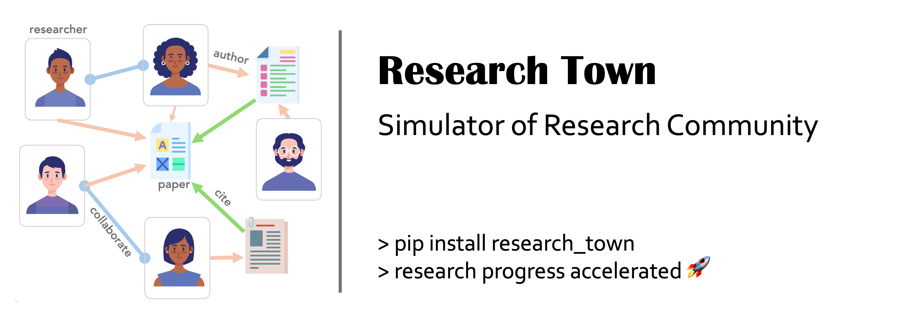

<div style="width: 100%;">
  </img>
</div>

<h1 align="center">Research Town: Simulator of Research Community</h1>

<div align="center">

[](https://www.python.org/downloads/release/python-3109/)
[](https://github.com/hiyouga/LLaMA-Factory/pulls)
[](https://github.com/ulab-uiuc/research-town)
[](https://discord.gg/TwXxGhMB)
[](assets/wechat.png)
[](https://codecov.io/github/ulab-uiuc/research-town)

</div>

## Introduction

**Research Town** is a multi-agent platform designed for studying community-level automatic research. To achieve community-based simulation, it defines:

1. 🤖 *Researcher*: LLM research agents capable of skills such as reading papers, writing papers, discussing ideas, rebutting arguments, and writing reviews.
2. 🎩 *Environments*: Multi-agent environments, similar to virtual study rooms, where research agents collaborate on tasks like idea discussion, rebuttal writing, or paper writing.
3. ⚙️ *Engines*: Finite-state machines that manage agent involvement in environments and determine the next steps after task completion. For instance, engines guide agents coming out of idea discussion environment to paper writing environment and help select suitable agents to work together.


## Get started

### Install from pip

You can install `research-town` from `pypi` to use it as a package:

```bash
pip install research-town
```

### Install from scratch

Use a virtual environment, e.g. with anaconda3:

```bash
conda create -n research-town python=3.10
conda activate research-town
curl -sSL https://install.python-poetry.org | python3
```

To run examples provided in the `examples`:

```bash
poetry install
cd examples
python research_town_demo.py
```

### Configure API keys

OpenAI key is required to run the code. Please set the environment variable `OPENAI_API_KEY` to your key. The recommend way is to add the key to the conda environment:
```
export OPENAI_API_KEY=<your_key>
# or if you want to make sure your key is auto-set each time you enter the environment
conda env config vars set OPENAI_API_KEY=<your_key>
```

## Developing

#### Develop Demo

To develop the demo (both frontend and backend):

```bash
cd frontend
npm install
npm start
```

```bash
poetry install -E backend
cd backend
uvicorn main:app --reload
```

#### Install dev options

Follow the installation instruction above and then, instead of running `python -m pip install -e .`, run the following commands:

```
python -m pip install -e ".[dev]"
mypy --install-types --non-interactive research_town
python -m pip install pre-commit
pre-commit install
```

The installation of pre-commit would avoid formatting error and large file injects into github commits.

#### New branch for each feature

`git checkout -b feature/feature-name` and PR to `main` branch.

#### Before committing

Run `poetry run pytest` to make sure all tests pass (this will ensure dynamic typing passed with beartype) and `poetry run mypy --config-file pyproject.toml .` to check static typing. (You can also run `pre-commit run --all-files` to run all checks)

#### Check github action result

Check the github action result to make sure all tests pass. If not, fix the errors and push again.


<p align="center">
<a href="https://star-history.com/#Significant-Gravitas/AutoGPT">
  <picture>
    <source media="(prefers-color-scheme: dark)" srcset="https://api.star-history.com/svg?repos=ulab-uiuc/research-town&type=Date&theme=dark" />
    <source media="(prefers-color-scheme: light)" srcset="https://api.star-history.com/svg?repos=ulab-uiuc/research-town&type=Date" />
    
  </picture>
</a>
</p>
