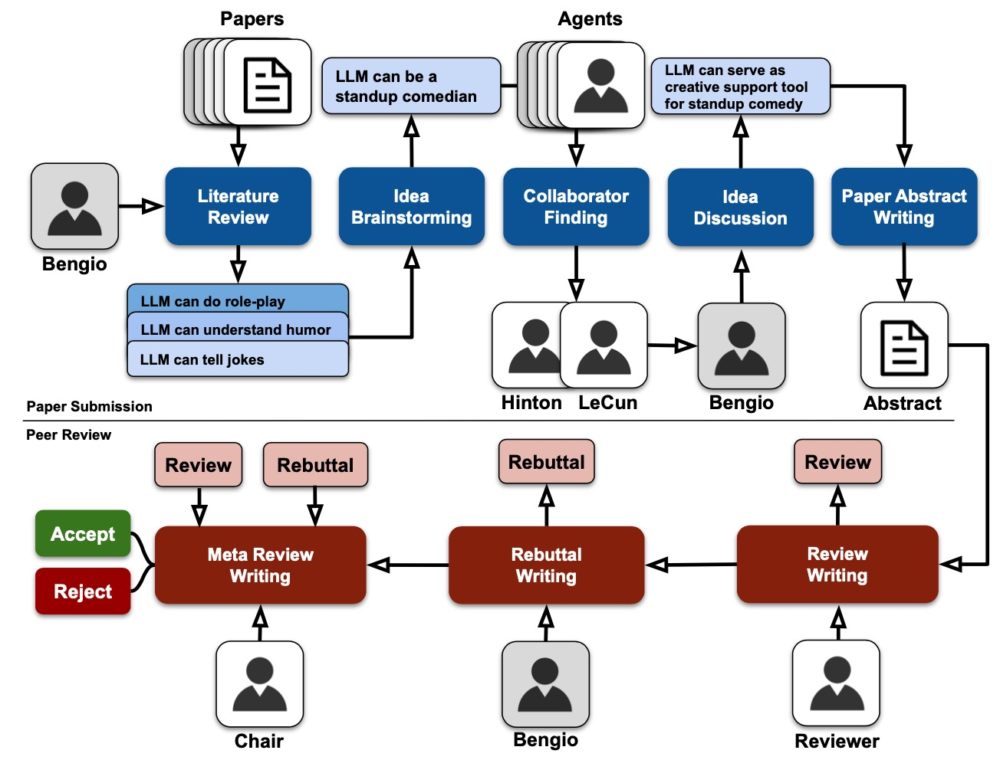
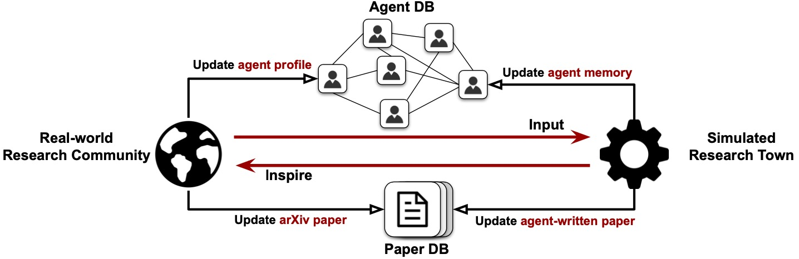

# About

**Research Town** is an LLM-based simulator  of human research, which can accelerate research
 progress and interactively provide insights to human researchers. To achieve this realistic, comprehensive, and interactive
multi-agent simulator for research community, **Research Town** does two things: First, it aligns LLM agents with real-world researchers and
 their public research activity. Second, **Research Town** covers the simulation of the full lifecycle of
 real-world research activities.

Moreover, we introduce **ResearchEval** that can
 be used to evaluate the research progress at various stages of the research lifecycle
 based on their general quality, faithfulness, and insightfulness.

## Research Town Tasks

### Literature Review

This task involves a research agent retrieving relevant papers from an external knowledge resource using an embedding-based matching method. The agent reads and summarizes insights from these papers, providing valuable information for ongoing research.

### Idea Brainstorming

Based on the insights gathered during the literature review, the agent engages in creative thinking to generate novel and valuable research ideas. The output of this task is an innovative idea that can guide future research.

### Collaborator Finding

When an agent has a research idea, this task helps identify potential collaborators. The agent reviews its network and uses an embedding-based matching method to select the most aligned collaborators to formalize the research idea.

### Idea Discussion

Identified collaborators engage in multi-agent discussions to refine and synthesize research ideas. The goal is to agree upon a high-quality research idea that will guide subsequent project phases.

### Paper Abstract Writing

Focusing on generating a paper abstract, this task uses a high-quality research idea to craft a detailed and compelling abstract through LLM-based prompting. This abstract is prepared for submission to a virtual conference.

### Review Writing

Once the paper abstract is submitted, selected reviewers with similar research experience assess the abstract. They provide qualitative feedback and an overall review score, helping to gauge the abstract's quality.

### Rebuttal Writing

The project lead responds to reviewers' comments and questions using LLMs. This interactive process helps address the feedback and improve the paper abstract, though reviewers do not change their scores in the simulation.

### Meta-Review Writing

A pre-defined chair analyzes the reviews and rebuttal to make a final decision on the paper abstract's acceptance. If rejected, the process cycles back to idea brainstorming until the abstract meets acceptance criteria.

## Research Town Engine

### Orchestration of Workflow

The engine manages the sequential execution of research tasks, distributing them at each timestep. It starts with a list of participating agents and aims to produce paper abstracts that reach acceptance level.

### Iterative Execution

Following a predefined execution policy, the engine iteratively triggers different research stages. This includes literature review, idea generation, collaborator finding, discussion, draft writing, review writing, rebuttal writing, and meta-review writing until acceptable drafts are produced.

### Human in the Loop

Human researchers can review and modify content during each stage, ensuring their expertise improves the research outputs. This approach allows for collaboration between human researchers and LLM agents, enhancing the quality of the research.

### Connection with Real-World Research Community

The engine integrates simulated and real-world research activities through AgentDB and PaperDB. AgentDB collects language agents based on human researcher profiles, while PaperDB catalogs academic papers from both real-world and simulated environments. This setup facilitates interaction and knowledge updates between human researchers and LLM agents.
